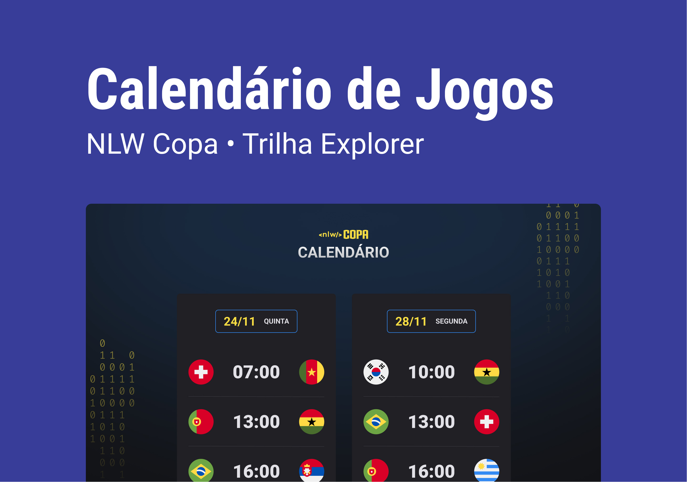
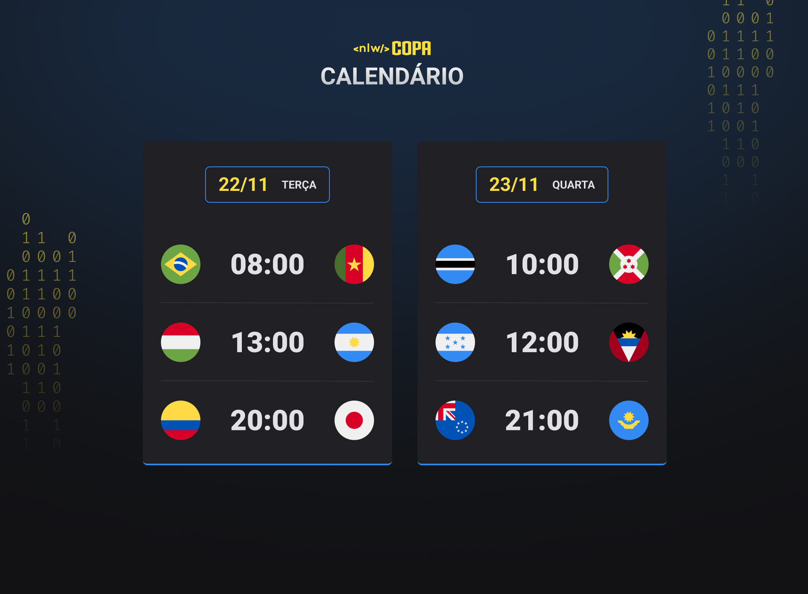

<h1 align="center"> NLW Copa </h1>

Evento exclusivo e gratuito, promovido pela Rocketseat para ensino de tecnologias WEB.

  <a href="#-tecnologias">Tecnologias</a>&nbsp;&nbsp;&nbsp;|&nbsp;&nbsp;&nbsp;
  <a href="#-projeto">Projeto</a>&nbsp;&nbsp;&nbsp;|&nbsp;&nbsp;&nbsp;
  <a href="#-deploy">Deploy</a>&nbsp;&nbsp;&nbsp;|&nbsp;&nbsp;&nbsp;
  <a href="#-layout">Layout</a>&nbsp;&nbsp;&nbsp;|&nbsp;&nbsp;&nbsp;
  <a href="#memo-licença">Licença</a>

  

 

  

## 🚀 Tecnologias

Esse projeto foi desenvolvido com as seguintes tecnologias:

- HTML e CSS
- JavaScript
- Git e Github

## 💻 Projeto

Criamos a partir do evento NLW Copa o Calendário de jogos da copa mundo, o qual busca deixar o usuário informado, em primeira mão, sobre os dias e horários dos jogos da copa.

Abaixo você pode acessar o projeto online e ver como ficou!

## 🌐 Deploy

Segue o resultado online do projeto • [copaDAY](https://andremfdev.github.io/copaday/)

## 🔖 Layout

Layout disponibilizado pelo evento do NLW da Rocketseat. Por razões de lei, não posso conceder acesso ao projeto original. Segue em PNG a base do design.
 
 
 

<h3 align="center"><strong>Desktop model</strong></h3>
 

  

 
<h3 align="center"><strong>Mobile model</strong></h3>
 

  

## :memo: Licença

Esse projeto está sob a licença MIT.

---

Made by andremfdev 👋

